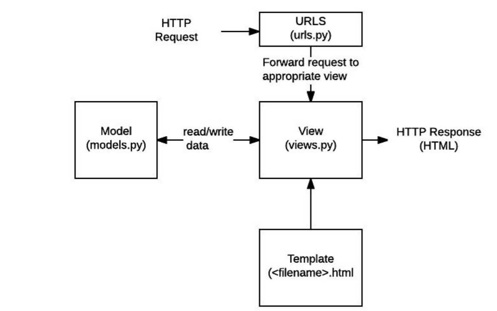

# Django Beginner's Tutorial

بِسْمِ اللَّهِ الرَّحْمَنِ الرَّحِيم

I learned Django through (https://developer.mozilla.org/en-US/docs/Learn/Server-side/Django). This is my understanding on how to build a simple django website. I am going to try to be as basic as possible regarding code in hopes in making it easier to understand. 

Table of Contents:

01. <a href="#skeleton">Building a Skeleton Project</a>
02. <a href="#models">Models</a>
03. <a href="#admin">Creating an Admin Site</a>
04. <a href="#homepage">Creating a Home Page</a>
05. <a href="#generic">Creating Generic Views</a>
06. <a href="#session">Session Framework</a>
07. <a href="#auth">User Authentication and Permissions</a>
08. <a href="#forms">Working with Forms</a>
09. <a href="#flatpages">Creating Flatpages</a>

<br></br><br></br>

<div id="skeleton">
  <h2>Building a Skeleton Project</h2>
  <h5>Side Note::</h5>
  <p>In this lesson, we're going to learn how to build a skeleton website for any project. This can be expanded out to other types of platforms with the technology and coding used in this lesson. The documentation does not include how to configure the web development server [webdev]. I may write this some other time.</p>
  <p>This is written in mind for Linux. For windows, replace <b>python3</b> with <b>python</b></p>
  
  <p>A website may consist of one or more sections (mainsite, blog, wiki, download, sandbox, etc). Django encourages to develop these components as separate applications, which could then be re-used in different projects if desired.</p>
  
<p>Creating any project starts with this command:</p>

    django-admin startproject projname
<p>This will create the following:</p>

    projname/
        manage.py
        projname/
            __init__.py
            settings.py
            urls.py
            wsgi.py

* manage.py | command line utility that lets you interact w/this project in various ways 
* \__init__\.py | An empty file that tells Python that this directory should be considered a Python Package 
* setting.py | settings/configuration for this project 
* url.py | The URL declaration for this project; a "table of contents" of your Django-powered site 
* wsgi.py | An entry-point for WSGI compatible web server to server your projects This tool creates a new folder and populates it with files for the different parts of the application

<p>Next, run the command</p>
    <code> python3 manage.py startapp appname</code>
    
<p>The updated project directory should look like this:</p>

      projname/
          manage.py
          projname/
          appname/
              migrations/
              __init__.py
              admin.py
              apps.py
              models.py
              tests.py
              views.py


* Migration folder is used to store "migration". These are files that allow you to automatically update your DB as you modify your models.
* __init__.py is an empty file created so that Django/Python will recognize it as a Python Package & all you to use its object within other parts of the project.
* Views should be stored in views.py, 
* Model in models.py, 
* tests in tests.py, 
* admin site configuration in admin.py 
* application registration in apps.py 

<h2>Registering the appname application</h2>
<p>Applications are registered by adding them to the INSTALLED_APPS list in the project settings. Edit: <b>projname/projname/settings.py</b> and find the definition for the <code>INSTALLED_APPS</code> list and add a new line @ the end of the list:</p>

```python
    INSTALLED_APP = [
        'django.contrib.admin',
        'django.contrib.auth',
        'django.contrib.contenttypes',
        'django.contrib.sessions',
        'django.contrib.messages',
        'django.contrib.staticfiles',
        'appname.apps.AppnameConfig',
    ]
```

<h5>Side Note::</h5>
<p>The 2nd appname after </b>.apps.</b> needs to start with a capital letter.</p>
 <code>
  appname.apps.AppnameConfig
  </code>    

<p>The new line specifies the application configuration object <b>appnameConfig</b> that was generated in <b>projname/appname/apps.py</b> during the application creation.</p>

<h2>Specifying the database & other project settings</h2>

<p>It makes sense to use the same database for development & production in order to avoid minor differences in behavior. Databases are configured in <b>projname/projname/settings.py</b>.</p>

* Settings.py is used for configuring a number of other settings such as TIME_ZONE
* SECRET_KEY is used as part of Django's website security strategy
* DEBUG enables debugging log to be displayed on error rather than HTTP status code responses. Setting it to FALSE disables it.

<h2>Hooking up the URL mapper</h2>

<p>Websites created are done with URL mapper file (urls.py). They are managed through the URL patterns variable, which is a Python list of URLs. Each URL() function either associates a URL pattern to a specific view or with another list of URL pattern testing code. </p>
  
<p>Edit: <b>projname/projname/urls.py</b></p>

  ```python
  from django.conf.urls import include

  urlpatterns += [
    url(r'^appname/', include('appname.urls')),
  ]
  ```
<p>Next, reroute the root URL (127.0.0.1) to the appname url (127.0.0.1/appname). This takes on a special view function (RedirectView), which takes as its 1st argument the new relative URL to redirect to (/appname).</p>

```python
    From django.views.generic import RedirectView

    urlpatterns +=[
        url(r'^$', RedirectView.as_view(url='/appname', permanent=True)),
    ]
```

<p>Django does not serve static files like CSS, JavaScript and images by default, but can be useful for webdev. To enable:</p>

```python
    from django.conf import settings
    from django.conf.urls.static import static

    urlpatterns +=static(settings.STATIC_URL, document_root=settings.STATIC_ROOT)
```

<h5>Side Note::</h5>
<p>This is separate from urlpattern = [admin]. Notice the +=. This demonstrates a separation of old & new code.There are a number of ways to extend the urlpatterns list. Another way:</p>

```python
    from django.conf.urls import url, include
    from django.contrib import admin
    from django.views.generic import RedirectView
    from django.conf import settings
    from django.conf.urls.static import static
 
    urlpatterns = [
        url(r'^admin/', admin.site.urls),
        url(r'^appname/', include('appname.urls')),
        url(r'^$', RedirectView.as_view(url='/appname', permanent=True)),
    ] + static(settings.STATIC_URL, document_root=settings.STATIC_ROOT)

```

<p>Finally, create a file inside your appname folder called urls.py and amend the following</p>

```python
    from django.conf.urls import url
    from . import views
    
    urlpatterns = [
    ]

```

<p>At this point of the lesson, we have completed the skeleton project. The website doesn't do anything yet, but it is worth testing it.
Run a database migration. This updates our dB to include any models in our installed app. (Anytime the model updates, these lines need to run)</p>

<code>
python3 manage.py makemigrations 
</code><br>
<code>
python3 manage.py migrate
</code>

* makemigration creates, but does not apply the migration for all apps installed in the project
* migrate applies the migration to the dB.

To run the devweb:
  <code> python3 manage.py runserver</code>
  
This concludes Building Skeleton Project
</div>

<br></br><br></br>
<div id="models">
  <h2>Models</h2> 
  <p>Django web application access and manage data through Python object referred to as models. Models define the structure of stored data.</p>
  <h5>Designing the Projname models</h5>
  <p> It is best to have separate models for every "object". An object is a group of related information. Books, Book Instances, and Authors are examples of what objects can be.</p>
  
  <p>You might want to use models to represent a options in a drop down rather than hard coding the selection choices on the web page itself. Once model and fields have been decided, you may awnt to think about relationships next. There are many types of relationships Django has to offer such as OneToOneField (one to one), ForeignKey (one to many), and ManyToManyField (many to many).</p>
  
<h5>Model primer</H5>
<p>Models are usually defined in an application's <b>models.py</b> file. They are implemented as subclasses of <code>django.db.models.Model</code> and can include fields, methods, and metadata.</p>

<h6>Fields</h6>
<p>A model can have arbitrary number of fields of any type - each one represents a column of data that we want to store in one of our db tables. Each db record (row) will consist of one of each field value. Example:</p>

    my_field_name = models.CharField(max_length=20, help_text="Enter Field Documentation.")
    

<p>The example above has a single field called <b>my_field_name</b> of type <code>models.CharField</code>. This means the field will contain strings of alphanumeric characters.</p>
  
<p>Field types are assigned using specific classes, which determine the type of record that is used to share the data in the db, along with validation criteria to be used when values are received from an HTML Form (valid value). The field type can also take arguments that further specify how the field is stored or can be used.</p>

<p>The order that fields are declared will affect their default order if a model is rendered in a form and the admin site; though this may be overridden.</p>

<h5>Common Field Arguments</h5>

* help_text: Provides a text label for HTML forms
* verbose_name: A human-readable name for the field used in field labels. If not specified, Django will assign one.
* default: The default value for the field. This can be a value or a callable object, in which case, the object will be called every time a new record is created.
* null: If True, Django will store blank values as NULL in db. Default is False
* blank: If True, the field is allowed to be blank in the forms. Default is False, which means Django's form validation will force you to enter a value. This is often used with null = true
* choices: A group of choices for this field. Think select boxes.
* primary key: If True, sets the current field as the primary key for the model. If no field is specified, Django will add a field for this purpose.

<a href="https://docs.djangoproject.com/en/1.10/ref/models/fields/#field-options" target="_blank">Full Field Options List</a>

<h5> Common Field Types</h5>

* CharField: used to define short-to-mid sized fixed length strings. You must specify max_length of the data to be stored. 
* TextField: used for large arbitrary-length strings. You may specify a max_length for the field, but this is used only when the field is displayed in a form (not enforced by db).
* IntegerField: a field for storing integer (whole number) values and for validating entered values as integers in forms.
- DateField and DateTimeField: for storing/representing dates and date/time information. 
  - auto_new = True: Sets the field to the current DTime every time the model is saved.
  - auto_now_add: Only set the date when the model is first created.
  - default: set default date that can be overridden by the user
* EmailField: store and validate email addresses
* FileField and ImageField: upload files and images respectively.
* AutoField: special type of IntegerField that auto increment primary key of this type is automatically added to the model
* ForeignKey: used to specify one-to-many relationship. The "one" sided of the relationship is the model that contains the key.
* ManyToManyField: many-to-may relationship. Example - a book can have several genres and each genre can contain several books.

<a href="https://docs.djangoproject.com/en/1.10/ref/models/fields/#field-types" target="_blank">Full Field Types List</a>

<h5>MetaData</h5>
<p>Metadatas can be declared by the class Meta.</p>

```python
    class Meta:
        ordering = ["-my_field_name"]
```

<p>One of the most useful features of the metadata is control the default ordering to the ordering attribute. The ordering will depend on the type of field.</p>

<p>Prefixing the minus sign (-) to reverse the sorting order.</p>

```python
ordering = ["Title", "-pubdate"]
```

<p>In this example, the books would be sorted alphabetically from A - Z, then by publication date inside each title, from newest to oldest.</p>
<p><code>verbose_name</code> is a common attribute and is written: <code>verbose_name = "BetterName" </code>. This is both for its plural and singular form.</p>

<a href="https://docs.djangoproject.com/en/1.10/ref/models/options/" target="_blank">Full Model Options List</a>

<h5>Methods</h5>
<p>A model can also have methods.</p>

<p>Minimally, in every model you should define the standard Python class method <code>__str__()</code> to return a human-readable string for each object. The string represent individual records in the administration site. This will return a title or name field from the model.</p>

```python
    def __str__(self):
        return self.field_name
```

<p>Another common method to include is <code>get_absolute_url()</code>. This returns a URL for displaying individual model records on the website. A typical pattern shown:

```python
        def get_absolute_url(self):
            """
            Returns the URL to access a particular instance of the model
            """
            return reverse("model-detail-view", args=[str(self.id)])
```

<h5>Model Management</h5>
<h6>Creating & Modifying Records</h6>
<p>To create a record, you can define an instance of the model then call <code>save()</code>

```python
    #Create a new record using the model's constructor
    a_record = ModelClassName(my_field_name="Instance #1")

    #Save the object into the database
    a_record.save()

```

<p>You can access the fields in this new record using the dot syntax (like JavaScript) and change values. Call <code>save()</code> to store the modifications.</p>

```python
    #Access model field values using Python attributes
    print(a_record.id) # Should return 1 for 1st record
    print(a_record.my_field_name) # Should print "Instance #1"

    #Change record by modifying the field, then call save()
    a_record.my_field_name = "New Instance Name"
    a_record.save()

```

<h6>Searching for Records</h6>
<p>To explain clearly, the Book object will be used as a model. You can search for records that match a certain criteria using the model's object attribute. You will need to use QuerySet (<code>objects.all()</code>) to get all records for a model. The QuerySet as an iterable object.</p>

```python
    all_books = Book.objects.all()
```

<p>Django's <code>filter()</code> method allows us to filter the returned QuerySet to match a specified text and numeric field against a particular criteria. In this example, it is searching for the word <b>"wild"</b> in the title as well as counts them.
  
```python
    wild_books = Books.objects.filter(title__contains="wild")
    number_wild_books = Books.objects.filter(title__contains="wild").count()
```

<p>The field to match and the type of match are defined in the filter parameter name using the format <code>field_name__match_type</code>.</p>

<p>Other types of matching:</p>

- icontains: case insensitive
- iexact: case-insensitive exact match
- exact: case-sensitive exact match
	
<a href="https://docs.djangoproject.com/en/1.10/ref/models/querysets/#field-lookups" target="_blank"> Full Field Lookup List</a>


<p>Sometimes, you'll need to filter on a field that defines a ForeignKey relationship to another model. In this case, you can <i>"index"</i> to fields within the related model with additional double underscores. In this example, a specific genre pattern is used as a filter for a book</p>

```python
    books_containing_genre = Books.objects.filter(genre__name__icontains = 'fiction')
    #Will match on Fiction, Science fiction, non-fiction, etc.
```

<h5>Defining the Projname Model</h5>
<p>In this section, we'll start defining the models for the projname. Open <b>/projname/appname/models.py</b>. 
 
  ```python
    from django.db import models
    # Create your models here
```

<p>This model (below) can be served as a template for any <b>appname</b> model. Notice the captalization of <code>ModelClassName</code> in various parts of the code. This is important! </p>

```python

from django.db import models
from django.urls import reverse # Used to generate URLs by reversing the URL pattern
from PIL import Image

# Create your models here.

class ModelClassName(models.Model):
    """
    Model representing the ModelClassName.  
    """
    foo = models.CharField(max_length=100, help_text="Enter some radom text here.", null=True, blank=True)
    bar = models.ManyToManyField(ModelClassName1, help_text="ModelClassName1 is a another model listed in the models.py file")
    foobar = models.ForeignKey('ModelClassName2', on_delete=models.SET_NULL, null=True)
    dateVariable = models.DateTimeField(auto_now_add=True, blank=True)
        
    #FileField used because a home page can have imagery
    images = models.FileField(null=True, blank=True)
    
    def __str__(self):
        """
        String for representing the Model object (in Admin site)
        """
        return self.title

    def get_absolute_url(self):
        """
         Returns the url to access a particular item.
        """
        return reverse('modelclassname-list', args=[str(self.id)])

```
<p>The variable <code>bar</code> has a ManyToManyField relationship. A good way of wrapping your head around it is to think like this - A book can have multiple genres and a genre can have multiple books. </p>

<p>The variable <code>foobar</code> has a ForeignKey relationship. ForeignKey relationship can be thought as each book has 1 author, but any author may have many books. Also, take notice this is wrapped with single quotes (''). </p>

<p>Here is an example on how to build a drop down list:</p>

```python
 #Build out the drop down here:
        LOAN_STATUS = (
            ('m', 'Maintenance'),
            ('o', 'On loan'),
            ('a', 'Available'),
            ('r', 'Reserved'),
        )
                                                #assign DD here
        status = models.CharField(max_length=1, choices=LOAN_STATUS, blank=True, default='m', help_text='Book availability')
```

<p>Lastly, things to make mention: </p>

1. <code>on_delete=models.SET_NULL</code> | set the value of the author to NULL if the associated author record is deleted.
2. <code>UUIDField</code> | used for the id field to set it as the primary_key for this model. This type of field allocates a globally unique value for each instance (one for every book you can find in the library).
3. <code>DateField</code> | used for the due_back date. This value can be blank or null The model metadata Class Meta uses this field to order records when they are returned in a query.
4. <code>status</code> | a CharField that defines a choice/selection list.

<p> The model defines <code>__str__()</code>, using the book's title field to represent a Book record. The final method, <code>get_absolute_url()</code> returns a URL that can be used to access a detail record for this model.</p>

<code>python3 manage.py makemigrations</code><br>
<code>python3 manage.py migrate</code>

<p>To run the devweb:</p>
<code> python3 manage.py runserver</code>

<p>This concludes Using Models</p>
</div>
<div id="admin">
	<h2>Creating an Admin Site</h2>
	<h5>Overview</h5>
	<p>The Django admin application can use your models to automatically build a site area that you can use to create, view, update and delete records. It is useful for managing data in production, depending on the type of website. Django recommends it only for internal data management (just used by admins). All the configuration required to include the admin application in your website was done automatically at the creations of the <a href="#skeleton"> Skeleton Project</a>. As a result, all you must do to add your models to the admin application is to register them</p>

<h5>Registering models</h5>
<p>Open <b>/projname/appname/admin.py</b>. You will see a simple template</p>

```python
    from django.contrib import admin

    #Register your models here.
```

<p>To register the models, copy the text at the bottom of the file. The code imports the models and then calls <code>admin.site.register()</code> to register each of them. This is the simplest way of registering the model(s) with the site.</p>

```python
    from django.contrib import admin
    from .models import ModelClassName1, ModelClassName2, ModelClassNameX

    #Register your models here.
    admin.site.register(ModelClassName1)
    admin.site.register(ModelClassName2)
    admin.site.register(ModelClassNameX)
```
<h5>Creating a superuser</h5>
<p>In order to log into the admin site, we need a user account. In order to view and create records, we need this user to have permissions to manage all our objects.</p>

```
    python3 manage.py createsuperuser
```

<p>This command creates full access to the site and all needed permissions using <b>manage.py</b>. You will be prompted to enter a username, email address and a strong password.
   
```   
    python3 manage.py runserver
```

<h5>Logging in and using the site</h5>
<p>To login to the site, open <b>http://127.0.0.1:8000/admin</b> and enter your newly created superuser credentials. This part of the site displays all the models, grouped by installed application. You can click on a model name to go to a screen that lists all its associated records. They can be further clicked to edit them. Also, you can directly click to <b>Add</b> link next to each model to start creating a record of that type.</p>

<p>Click on the <b>Add</b> link to the right of the <b>ModelClassName</b> to create a new item. Enter values for the fields. When done, press <b>SAVE</b>, </b>Save and add another</b>, or <b>Save and continue editing</b> to save the record.</p>

<h5>Advanced configuration</h5>
<p>Django does a good job of creating a basic admin site using the information from the registered models:</p>

1. Each model has a list of individual records, identified by the string created with the model's <code>__str__()</code> method, and linked to detail views/forms for editing.
2. The model detail record forms for editing and adding records contain all the fields in the model, laid out vertically in their declaration order.

<p>You can further customize the interface to make it even easier to use. </p>

- List Views:
1. add additional fields/information displayed for each record.
2. add filters to select which records are listed.
3. add additional options to the actions menu in list views and choose where this menu is displayed on the form.

- Detail views:
1. Choose which fields to display (or exclude), along with their order, grouping whether they are editable, the widget used, orientation, etc.
2. Add related fields to a record allow inline editing

<p>You can find a complete reference of all the admin site in The <a href="https://docs.djangoproject.com/en/1.01/ref/contrib/admin/"> Django Admin site</a>.</p>

<h6>Register a ModelAdmin class</h6>
<p>The <code>ModelAdmin</code> class allows you to change how a model is displayed in the admin site. Open <code>/projname/appname/admin.py</code> and comment out the original registration for the <code>ModelClassName</code> class:</p>

```python
    #admin.site.register(ModelClassName)
```
<p>And add a new <code>ModelClassName</code> and registration as shown below:</p>

```python
    # Define the admin class
    class ModelClassNameAdmin(admin.ModelAdmin):
        pass

    # Register the admin class with the associated model
    admin.site.register(ModelClassName, ModelClassNameAdmin)

```

<p>Repeat for the other <code>ModelCassName</code> classes. You can register the model with a decorator (as shown below) instead of <code>admin.site.register()</code>:</p>

```python
    @admin.register(ModelClassName)
    class ModelClassNameAdmin(admin.ModelAdmin):
        pass
```

<h6>Optional - Configure list views</h6>
<p>To create column headers, replace the pass as shown below. Review any other classes that may require this update:</p>

```python
    @admin.register(ModelClassName)
    class ModelClassNameAdmin(admin.ModelAdmin):
        list_display = ('foo', 'bar', 'foobar')
```

<p>Finally, fields are displayed vertically by default, but will display horizontally if you further group them in a tuple, as so:</p>

```python
    @admin.register(ModelClassName)
    class ModelClassNameAdmin(admin.ModelAdmin):
        list_display = ('foo', 'bar', 'foobar')
        fields = [('foo', 'bar'), 'foobar']

```

<p>You can add "sections" to group related model information within the detail form, using the fieldset attributes. For example:</p>

```python
    @admin.register(ModelClassName)
    class ModelClassNameAdmin(admin.ModelAdmin):
        list_display = ('foo', 'bar', 'foobar')
        list_filter = ('ascending', 'descending')
    
        fieldsets = (
            (None, {
                'fields': ('test1','test2', 'id')
            }),
            ('Availability', {
                'fields': ('ascending', 'descending')
            }),
        )
```

<p>To declare inline editing of associated records:</p>

```python
    class ModelClassNameInline(admin.TabularInline):
        model = ModelClassName

    @admin.register(ModelClassName)
    class ModelClassNameAdmin(admin.ModelAdmin):
        list_display = ('foo', 'bar', 'foobar_tag')
        inlines = [ModelClassNameInline]
```

<p>Restart the application to view your changes.<br>
This concludes Creating an Admin site</p>
</div>

<div id="homepage">
	<h2>Creating a Home Page</h2>
	<p>We are now ready to add the code to display our first full page - a home page for the <b>projname</b> website. Also, we'll gain practical experience in writing basic URL maps and views, getting records from the db, and using templates.</p>
	
<h5>Overview</h5>
<p>Now we have defined our models and created some initial records to work with, it's time to write the code to present that information to the users. First, we need to determine what information is needed to be able to display in our pages, then define the appropriate URLs for returning those resources. Lastly, we need to create the url mapper, views, and templates to display those pages.</p>

<p> The diagram below is a reminder of the main flow of data and items that needs to be implemented when handling the HTTP rquest/response. We've already created the model, the main item to focus on next are: </p>

- URL maps to forward the supported URLs to the appropriate view functions
- View functions to get the requested data from the models, create an HTML page displaying the data, and return it to the user to view in the browser
- Templates used by the views to render the data

<br></br>

<h5>URL mapping</h5>
<p>In the <a href="#skeleton">Building a Skeleton Project</a>, we created a basic <b>/projname/appname/urls.py</b> file for our <b>appname</b> application. The <b>appname</b> application URLs were included into the project with a mapping of <b>appname/</b>. So, the URLs that get to this mapper must start with <b>appname/</b>. </p>

<p>Edit <b>/projname/appname/urls.py</b> by copying and pasting the code below:</p>

```python
	urlpatterns = [
		url(r'^$', 'views.index', name='index'),
	]
```

<h6>Side Note::</h6>
<p>If you’re coding in Visual Studio Code, it will complain about <code>views.index</code>. Ignore it until you’ve completed the View(function-based) below.</p>

<p>This <code>url()</code> function defines a URL pattern <code>r'^$'</code> (regular expression - we'll discuss about RegEx in a later lesson). A view function will be called if the pattern detects <code>views.index</code> (a function named <code>index()</code> in <b>/projname/appname/views.py</b>). It specifies a name parameter, which uniquely identifies this particular URL mapping. You can use this name to "reverse" the mapper (to dynamically create a URL pointing to the resources the mapper is designed to handle). For example, we can link our home page by creating the following link in our template:</p>

```django
	<a href="">Home</a>
```

<h6>Side Note::</h6>
<p> We can hard code the above link like this: </p>

```html
	<a href="/appname/"<Home</a>
```
<p>But then if we changed the pattern for our home page (e.g to /appname/index), the template would no longer link correctly. Using a reversed url mapping is much more flexible and robust.</p>

<h5>View (function-based)</h5>
<p>A view function is a function that processes an HTTP request, fetches data from the db (as needed), and generates an HTML page by rendering this data using an HTML template. It then returns the HTML in an HTTP response to be shown to the user. </p>

<p>Open <b>projname/appname/views.py</b>. Note, the file already imports the <code>render()</code> shortcut function. This generates HTML files using a template and data. </p>

```python
	from django.shortcuts import render
	#create your views here. 
```

<p>Copy and paste the following code. The first line imports the model classes that we will use to access data in all our views. </p>

<a href="https://developer.mozilla.org/en-US/docs/Learn/Server-side/Django/Home_page"> MDN - Creating a Home Page</a>

```python
	from django.shortcuts import render
	from .models import ModelClassName1, ModelClassName2
	
	#create your views here.
	def index(request):
	"""
	View function for home page of site.
	"""
	
	# Generate counts of some of the main objects
	gen_count = ModelClassName.objects.all().count()
	# Render the HTML template index.html with the data in the
	context variable
	return render(
		request,
		'index.html',
		context={'gen_count':gen_count},
	)
```
<h5>Template</h5>
<p>A template in Django are like partials in AngularJS. They define the structure or layout of a file with placeholders used to represent the actual content. Django will automatically look for templates in a directory named <i>"templates"</i> in your application. As of now, accessing <code>127.0.0.1:8000</code> raises an error stating the file cannot be found. Templates are located in <b>/projname/appname/templates</b>.

<h6>Extending templates</h6>
<p>The index template requires a standard HTML markup for the head and body, along with sections for navigation (to other pages we haven't yet created) and for displaying some introductory text and our data. Rather than forcing to duplicate this <i>"boilerplate"</i> in every page, Django templating language allows you declare a base template and then extend it by replacing just the bits that are different for each specific page.</p>
<p>When we want to define a template for a particular view, first, specify the base template with the extendscontent block. The final HTML produced would have all the HTML and structure defined in the base template.</p>

```django
	
	
	<h1>Local Library Home</h1>
	<p>Hello <em>World!</em>. This is a very basic Django website developed as a tutorial.</p>
	
```

<h6>The projname base template</h6>
<p>The base template for the projname website is listed below. As you see, this contains some HTML and defined blocks for title, sidebar, and content. There is a default title and sidebar with links to lists of all items. To get started, create a new file <b>/projname/appname/templates/base_generic.html</b> and give it the following contents:</p>

```django
	<!DOCTYPE html>
	<html lang="en">
	<head>
		<title>PROJNAME TITLE</title>
		<meta charset="utf-8">
		<meta name="viewport" content="width=device-width, initial-scale=1">
		<link rel="stylesheet" href="https://maxcdn.bootstrapcdn.com/bootstrap/3.3.7/css/bootstrap.min.css">
		<script src="https://ajax.googleapis.com/ajax/libs/jquery/1.12.4/jquery.min.js"></script>
		<script src="https://maxcdn.bootstrapcdn.com/bootstrap/3.3.7/js/bootstrap.min.js"></script>

		<!-- Add additional CSS in static file -->
		
		<link rel="stylesheet" href="">
	</head>
	<body>
		<div class="container-fluid">
			<div class="row">
				<div class="col-sm-2">
				
					<ul class="sidebar-nav">
						<li><a href="">Home</a></li>
						<li><a href="">All MODELCLASSNAME1</a></li>
						<li><a href="">All MODELCLASSNAME2</a></li>
					</ul>
				
				</div>
				<div class="col-sm-10 ">
				
				</div>
			</div>
		</div>
	</body>
	</html>
```

<p>The template uses (and includes) JavaScript and CSS from Bootstrap. The base template also references a local css file (styles.css). Create <b>/projname/appname/static/css/styles.css</b> and give it this content:</p>

```css
	.sidebar-nav {margin-top: 20px; padding: 0; list-style: none;}
```

<h6>The index template</h6>
<p>Create the HTML file <b>/projname/appname/templates/index.html</b> and give it the content shown below. As you see, we extend our base template in the first line, then replaces the default content block with a new one for this template. Further edit where needed:</p>

```django
	
	
	<h1>PROJNAME Home</h1>
	<p>Hello <em>World!</em>. This is a very basic Django website developed as a tutorial.</p>
	
	<h2>Dynamic content</h2>
	<p>INSERT WITTY MESSAGE HERE:</p>
	<ul>
		<li><strong>Item 1:</strong> {{ gen_count }}</li>
	</ul>

	
```

<p>Django uses the same <code>{{}}</code> (template variables) as AngularJS. This is our dynamic content. This is different from <code>{}</code>, also known as template tags. These tags are enclosed in a single brace with <code>%</code> (percentage) sign.</p>
	
<h6>Referencing static files in templates</h6>
<p>This project is likely to use static resources, including JavaScript, CSS, and images. Django allows you to specify the location of these files in your template relative to the <code>STATIC_URL</code> global setting. The default skeleton website sets the value of <code>STATIC_URL</code> to <b>'/static/'</b>. You may choose to host these on a CDN or elsewhere. Within the template, you first call the load template tag specifying <i>"static"</i> to add this template item. After static is loaded, you can then use the static template tag to specify the relative URL  to the file of interest.</p>
	
```django
	<!-- Add additional CSS in static file -->
	
	<link rel = "style" href="">
```
<p>If desired, add an image into the page in the same fashion:</p>

```django
	
	
```	

<h6>Side Note::</h6>
<p>The changes above specify where the files are located, but Django does not serve them by default. While we enabled serving by the webdev in the global URL mapper <b>/projname/appname/urls.py</b>, you will still need to arrange for them to be served in production. We'll look at this later. </p>

<h5>Linking to URLs</h5>
<p>The base template above introduced the url template tag.</p>

```django
	<li><a href="">Home</a></li>
```

<p>This tag takes the name of a <code>url()</code> function called in your <b>urls.py</b> and values for any arguments the associated view will receive from that function. It returns a URL that you can use to link to the resource. What does it look like? At this point, we should have created everything needed to display the index page. </p>

```
	python3 manage.py runserver
```

<p>Open your browser to the local host. If everything is set up correctly, you should see the index page.<br>
This concludes Creating a Home Page</p>

</div>
<div id="generic">
<h2>Creating Generic Views</h2>
<p>This lesson extends our <b>projname</b> website, adding list and detail pages for our <code>ModelClassName</code> items. We'll learn about generic class-based views and show how they can reduce written code for common use cases. Finally, we'll go into URL handling in greater detail, showing how to perform basic pattern matching (RegEx). </p>

<h5>Overview</h5>
<p>The process is similar to creating the index page shown in the previous lesson. Still, we'll need to create URL maps, views, and templates. Detail pages will have additional challenges of extracting information from patterns in the URL and passing it to the view. For these types of pages, we're going to demonstrate a completely different type of view - generic class-based list and detail views. These generic views reduce the amount of view code needed and makes them easier to write or maintain.</p>

<h5>URL Mapping</h5>
<p>Open <code>/appname/urls.py</code> and copy in the line shown in bold below. Edit where needed. This <code>url()</code> function defines a regular expression (RegEx) to match against the <code>URL(r'^MODELCLASSNAME/$')</code>, a view function that will be called if the URL matches <code>(views.MODELCLASSNAMEListView.as_view())</code> and a name for this particular mapping.</p>

```python
	urlpatterns = [
		url(r'^$', views.index, name='index'),
		url(r'^ModelClassName/$', views.ModelclassnameListView.as_view(), name='foobar'),
	]

```
<p>The RegEx here matches against URLs that equal to 'foobar'. In this case, it is the lowercase version of <code>modelclassname/</code>.

- ^ | String start marker
- $ | String end marker

<p>The view function has a different format than before because this view will actually be implemented as a class. We'll be inheriting from an existing generic view function instead of writing our own from scratch. For Django class-based views, we access an appropriate view function by calling the class method <code>as_view()</code></p>.

<h5>View (class-based)</h5>

<p>ListView is a class that inherits from an existing view. Because the generic view already implements most of the functionality we need, and follows Django best-practice, we will be able to create a more robust list view with less code, less repetition, and ultimately less maintenance. Edit <b>/appname/views.py</b> and add the following to the existing code:</p>

```python
	from django.views import generic
	
	class ModelClassNameListView(generic.ListView):
		model = ModelClassName
```

<p>That is it. The generic view will query the db to get all records for the specified model <code>ModelClassName</code>, and then render a template located at <b>/projname/appname/templates/appname/modelclassname_list.html</b> . Within the template, you can access the list of books with the template variable name <b>object_list</b> OR <b>modelclassname_list</b>.<p>

<p>Attributes can be added to change the default behaviour above. You can specify another template file if you need to have multiple views that use this same model. <p>
	
<p>You might want to use a different template variable name if <b>modelclassname_list</b> is not intuitive for your particular template use-case. Possibly the most useful variation is to change/filter the subset of results that are returned this way you can list the top X of items that were viewed by other users.</p>

```python
	class ModelClassNameListView(generic.ListView):
		model = ModelClassName
		context_object_name = 'my_modelclassname_list' # your own name for the list as a template variable
		queryset = ModelClassName.objects.filter(title__icontains='insert random meaningful word here')
		template_name = 'modelclassname/my_arbitrary_template_name_list.html' # Specify your own template name/location
```

<h6>Creating the List View template</h6>
<p> Create an HTML file called <b>/projname/appname/templates/appname/item_list.html</b> and edit the text below.
	
```django
	
	
	<h1>Modelclassname List
	
	<ul>
	
		<li><a href="{{ modelclassname.get_absolute_url }}">{{ modelclassname.item1 }}</a> ({{modelclassname.item2}})</li>
	
	</ul>

	
	<p>There are no modelclassname in the appname.</p>
	

	
```

<p>Template for generic views are just like any other templates. For our index template, we extended the base template in the first line, just like how you would do with partials with Angular.</p>

<h6>Conditional execution</h6>
<p>We use the if, else, and endif template tags to check whether the item_list has been defined and is not empty. If it's empty, then we display a text explaining there are no more items to display.</p>

```django
	
	<!-- code here to list the items -->
	
		<p>There are no modelclassname in the appname.</p>
	
```
<p>The condition above only checks for 1 case, but you can test on additional conditions using the elif template - <code></code> where var2 is variable2.</p>

<h6>For loops</h6>
<p>We use the for and endfor template tags to loop through the <code>modelclassname</code> list. 

```django
	
		<!-- code here get information from each item -->
	
```

<h6>Accessing variables</h6>
<p>As discussed before, Django is just like Angular when accessing variables inside the HTML page:</p>

```django
	<li>
		<a href="{{ modelclassname.get_absolute_url }}">{{ modelclassname.title }}</a>
		({{modelclassname.item}})
	</li>
```

<h5>Update the base template</h5>
<p>Edit the base template <b>/projname/appname/templates/base_generic.html</b> and insert <code> {% url 'modelclassname' % }</code> into the URL link for All Modelclassname, as shown below.</p>

```django
	<li><a href="">Home</a></li>
	<li><a href="">Foobar Menu</a></li>
```

<p>You won't be able to build the item list because it is still missing a dependency. The URL map for the <code>modelclassname</code> detail pages, which is needed to create hyperlinks to individual items. We'll show both list and detail views after the next section.</p>

<h6>Updating the URL mapping</h6>
<p>Edit <b>/appname/urls.py</b> and add the <code>modelclassname-detail</code> URL mapper shown below. This <code>url()</code> function defines a pattern, associated generic class-based detail view, and a name.</p>

```python
	urlpatterns = [
		url(r'^$', views.index, name='index'),
		url(r'^modelclassname/$', views.ModelclassnameListView.as_view(), name='modelclassname'),
		url(r'^modelclassname/(?P<pk>\d+)$', views.ModelclassnameDetailView.as_view(), name='modelclassname-detail'),
	]
```
<p>Unlike the previous mapper, in this case, we're using RegEx to match against a real "pattern" rather than just a string. This RegEx matches against any URL that starts with <code>modelclassname</code>, followed by one or more digits before the end of the line marker. While performing the matching, it "captures" the digits, and passes them to the view function as a parameter named <code>pk</code>.

<h6>Side Note</h6>
<p><span color="red">Important</span> : The generic class-based detail view expects to be passed as parameter named <code>pk</code>. If
you're writing your own function view, you can use whatever parameter name you like, or indeed pass the information in an unnamed argument.</p>

<h6>A lightning RegEx primer</h6>
<p>RegEx are an incredibly powerful pattern mapping tool. RegEx should usually be declared using the raw string literal syntax. They are enclosed as shown:</p>

- r'(your RegEx text goes here)'

<p>Other pattern matches are:</p>

- ^ | Match the beginning of the text
- $ | Match the end of the text
- \+ | Match one or more of the preceding characters.
- \* | Match zero or more of the preceding character.
- \d | Match a digit (0, 1, 2, ... 9)
- \w | Match a word character (e.g. - uppoer or lower case in the alphabet, digit or the underscore character '_' )
- () | Capture the part of the pattern inside the brackets. Any captured values will be passed to the view as unnamed parameters (? P< name>...) - Capture the pattern (indicated by ...) as a named variable (in this case "name"). The captured values are passed to the view with the name specified. Your view must therefore declare an argument with the same name!
- [] | Match against one character in the set.


<h6>Updating the View (class-based)</h6>
<p>Edit <b>appname/views.py</b> and paste the following under ListView :</p>

```python
	class ModelClassNameDetailView(generic.DetailView):
		model = ModelClassName
```

<p>That is it. All you need to do now is create a template called <b>/projname/appname/templates/appname/modelclassname_detail.html</b> and the view will pass it the db information for the specific item record extracted by the URL mapper. What happens if the record doesn't exist? If a requested record doesn't exist, then the generic class-based detail view will raise an Http404 exception for you automatically.</p>


<h5>Creating the Detail View template</h5>
<p>Edit the HTML file <b>/projname/appname/template/appname/modelclassname_detail.html</b> with the content below.</p>

```django
	
	
	<h1>Item0: {{ modelcassname.item0 }}</h1>
	<p><strong>Item1:</strong> {{ modelclassname.item1 }}</p>
	<p><strong>Item2:</strong> {{ modelclassname.item2 }}</p>
	<p><strong>Item3:</strong> 
	 {{itemX }}, </p>
	<div style="margin-left:20px;margin-top:20px">
		<h4>Random Meaningful Title </h4>
		
		<hr>
		<p class="text-successtext-dangertext-warning">{{ foo.modelclassnameinstance_item }}</p>
		
		<p><strong>Meaningful Text Here:</strong> {{copy.due_back}}<p>
	
	</div>
	
```

<h6>What does it look like?</h6>
<p>Run the server and open your browser to the local host. Make sure the web page launches and click through what you have configured. To add pagination to the web page, edit <b>appname/views.py</b>:</p>


```django 
	class ModelClassNameListView(generic.ListView):
		model = ModelClassName
		paginate_by = X # Where X = a number (e.g. paginate_by = 10)
```

<p>We'll need to add support to the template to scroll through the paginated web page. Edit <b>/projname/appname/templates/base_generic.html</b> with the following pagination block below our content block.</p>

```django
	
	
	<div class="pagination">
		<span class="page-links">
		
			<a href="{{ request.path }}?page={{page_obj.previous_page_number }}">previous</a>
		
		<span class="page-current"> Page {{ page_obj.number }} of {{page_obj.paginator.num_pages }}.</span>

		
		<a href="{{ request.path }}?page={{page_obj.next_page_number }}">next</a>
		
		</span>
	</div>
	
	
```
<p>This concludes Creating Generic Views</p>
</div>


<div id="session">
<h2>Session Framework</h2>
<p>The HTTP protocol handles all communication between web browsers and servers. It is stateless. This means messages between the client and server are completely independent of each other. There is no such thing of sequence or behavior based on previous messages.</p>
	
<p>Sessions are the mechanism used by Django for keeping track of the "state" between the site and a particular browser. Sessions allow you to store arbitrary data per browser and have this data available to the site whenever the browser connects. Individual data items associated with the session are then referenced by a <b>key</b>.</p>

<p>Django uses a cookie containing a special session id to identify each browser and its associated session with the site. The actual session data is stored in the site database by default. Django can be configured to store the session data in other places, but the default location is a good and relatively secure option.</p>

<p>Sessions are enabled automatically at the creation of the <a href="#skeleton">Skeleton Project</a> . The configuration is set up in the <code>INSTALLED_APPS</code> and <code>MIDDLEWARE</code> sections of the project file <b>projname/projname/settings.py</b>.</p>

<p>You can access the session attribute in the view from the request parameter. This session attribute represents the specific connection to the current user. The session attribute is a dictionary-like object that you can read and write as many times as you like in your view. You can do all the normal dictionary operations, including, but not limited to:</p>

- Clearing all data
- Testing if a key is present
- Looping through data

<p>Most of the time, you'll just use the standard "dictionary" API to get and set values. The API offers a number of other methods that are mostly used to manage the associated session cookie. For example, there are methods to test that cookies are supported in the client browser, to set and check cookie expiry dates, and to clear expired sessions from the data store. </p>

<a href="https://docs.djangoproject.com/en/2.2/topics/http/sessions/" target="_blank">How to use sessions</a>

<p>Django only saves to the session db and sends the session cookie to the client when the session has been modified or deleted. As a simple real-world example, we'll update our <b>projname</b> to tell the current user how many times they have visited the <b>projname</b> home page. Edit <b>/projname/appname/views.py</b> with the code below:</p>


```python
	def index(request):
		...
		gen_count = ModelClassName.objects.all().count() # The 'all()' is implied by default.
		
		# Number of visits to this view, as counted in the session variable.
		num_visits=request.session.get('num_visits', 0)
		request.session['num_visits'] = num_visits+1

		# Render the HTML template index.html with the data in the context variable

		return render(
			request,
			'index.html',			  #num_visits appended
			context={'gen_count':gen_count, 'num_visits': num_visits}, 
		)

```

<p>This code gets the value of the <code>num_visits</code> session key, setting the value to 0 if it has not previously been set. Each time a request is received, we then increment the value and store it back in the session. The <code>num_visits</code> variable is passed to the template in our context variable. Edit <b>/projname/appname/templates/index.html</b> to add a visual display on your website.</p>

```django
	<p>You have visited this page {{ num_visits }} time times.</p>
```

<p>Save your changes and restart the test server. Everytime the page is refreshed, the number should update.</p>
This concludes Sessions Framework

</div>

<div id="auth">
<h2>User Authentication and Permissions</h2>
<h5>Overview</h5>
<p>Django provides an authentication and authorization systems, which is built on top of the session framework discussed in the previous lesson. In this lesson, we're going to learn how to:</p>
	
 - Enable user authentication in the projname website
 - Create your own login and logout pages
 - Add permissions to your models
 - Control access to pages
 
 <p>Django's authentication system is flexible. You can build URLs, forms, views and templates from scratch by just calling the provided API to login the user (if you like). Instead, we're going to use the stock authentication views and forms for our credential/account pages. We'll need to create templates as well as show how to create permissions, check on login status and permissions in both views and templates.</p>

<p>Our first user was created when we looked at the <a href="#admin">Creating an admin site</a> lesson. Our superuser is already authenticated and authorized, so  our next step is to create a test user to represent a normal site user. We'll be using the admin site to create our <b>projname</b> groups and logins as this is the quickest way to do so.</p>

<p>Start the <b>webdev</b> and navigate to the admin site at <b>http://127.0.0.1:8000/admin/</b>. From the Authentication and Authorization section, click the Users or Groups links. This will allow you to see their existing records. Next, create a new group for the members. </p>

 1. Click the Add button (next to Group) to create a new Group ; enter a name for the group.
 2. We don't need any permissions for the group, so press SAVE .
 
<p>Lets create a user:</p>

 1. Navigate back to the home page of the admin site
 2. Click the Add button next to Users to open the Add user dialog.
 3. Enter an appropriate Username and Password/Password confirmation for your test user.
 4. Press SAVE to create the user

<p>The admin site will create the new user and immediately take you to a Change User screen where you can change the username and add information for the User model's optional fields. These fields include the first & last name, email address, the users status and permissions. Click <b>SAVE</b> to go to the list of users.</p>

<h6>Authentication Key Setup</h6>
<p>Django provides almost everything needed to create authentication pages in order to handle login, logout and password management. This includes an url mapper, views and forms, but not templates. You'll be shown how to integrate the default system into the <b>projname</b> website and create templates.</p>

<h5>Project URLs</h5>
<p>Edit <b>projname/projname/urls.py</b> and append this to the bottom of the file:</p>

```python
	#Add Django site authentication urls (for login, logout, password management)
	urlpatterns += [
		url(r'^accounts/', include('django.contrib.auth.urls')),
	]
```
<p>Navigate to the <b>http://127.0.0.1:8000/accounts/</b> . Note - This will fail.</p>
<p>Next, navigate to the login URL <b>http://127.0.0.1:8000/accounts/login/</b>. This will fail again, but with an error that tells you that it's missing the required template (<b>registration/login.html</b>) on the template search path. You'll see the following lines:</p>

```
	Exception Type: TemplateDoesNotExist
	Exception Value: registration/login.html
```

<h5>Template Directory</h5>
<p>The urls (and implicitly views) that was just added expect to find their associated templates in a directory <b>/registration/</b> somewhere in the templates search path. Your folder structure should look like this:</p>

```
	projname(django project folder)
	|_ appname
	|_ projname
	|_templates( new )
		|_ registration
```

<p>To make these directories visible to the template loader, open the project settings <b>/projname/projname/settings.py</b> and update the <code>TEMPLATES</code> section's <code>'DIRS'</code> line as shown below:</p>

```python
	TEMPLATES = [
	{
		...
		'DIRS': ['./templates',],
		'APP_DIRS': True,
		...
	}
```

<h5>Login template</h5>
<p>Important! : The authentication templates provided are very basic/slightly modified version of the Django demo login templates. You may need to customize them for your own use. Create a new HTML file called <b>/projname/templates/registration/login.html</b> and give it the following contents:</p>

```django

	
	
	
		<p>Your username and password didn't match. Please try again.</p>
	

	
		
			<p>You don't have access to this page. To proceed, please login with an account that has access.</p>
		
			<p>Please login to see this page. </p>
		
	
	<form method="post" action="">
	
		<div>
			<td>{{ form.username.label_tag }}</td>
			<td>{{ form.username }}</td>
		</div>
		<div>
			<td>{{ form.password.label_tag }}</td>
			<td>{{ form.password }}</td>
		</div>
		<div>
			<input type="submit" value="login" />
			<input type="hidden" name="next" value="{{ next }}" />
		</div>
	</form>
	{# Assumes you setup the password_reset view in your URLconf #}
	<p><a href="">Lost password?</a></p>
	
```

<p>This template shares some similarities with prior ones we've seen before. It extends our base template and overrides the content block. The rest of the code is a standard form of handling code, which we'll discuss later. All you need to know for now is this will display a form in which you can enter your credentials and will be prompted to enter the correct information if you entered an invalid value.</p>

<p>Navigate back to the login page <b>http://127.0.0.1:8000/accounts/login</b> on the webdev once you've saved your template. You should see a login screen. When you login, you'll be redirected to another page. By default, it is <b>http://127.0.0.1:8000/accounts/profile/</b>.<br>This may fail on you as this page has yet to be defined.</p>

<p>The problem here is by default Django expects that after you login, you will want to be taken to a profile page. To do so, open the project settings <b>/projname/projname/settings.py</b> and add the text below to the bottom. Now, when you login, you should be redirected to the site home page by default. </p>

```python
	# Redirect to home URL after login (Default redirects to /accounts/profile/)
	LOGIN_REDIRECT_URL = '/'
```

<h5>Logout template</h5>
<p>You'll see some odd behavior when you navigate to the logout url. Your user will be logged out for sure, but you'll be taken to the Admin logout page. This is not what we want. Create and edit <b>/projname/templates/registration/logged_out.html</b>:</p>


```django
	
	
	<p>Logged out!</p>
	<a href="">Click here to login again.</a>
	
```

<p>This template is very simple. It displays a message informing the user that he/she have been logged out and provides a link that can go back to the login screen.</p>

<h5>Password reset templates</h5>
<p>The default password reset system uses email to send the user a reset link. Forms are required to be created to get the user's email address, send the email, allow them to enter a new password, and to note when the whole process is complete. This form used below gets the user's email address. Create <b>/projname/templates/registration/password_reset_form.html</b>, and give it the following contents:</p>


```django
	
	
	<form action="" method="post">
		 {{ form.email.errors }} 
			<p>{{ form.email }}</p>
		<input type="submit" class="btn btn-default btn-lg" value="Reset password" />
	</form>
	
```

<p>This form is displayed after the email address has been collected. Create and edit <b>/projname/templates/registration/password_reset_done.html</b> :</p>

```django
	
	
	<p>We've emailed you instructions for setting your password. If they haven't arrived in a few minutes, check your spam
folder.</p>
	
```

<p>This template provides the text of the HTML email containing the reset link that we will send to users. Create and edit <b>/projname/templates/registration/password_reset_email.html</b></p>


```django
	Someone asked for password reset for email {{ email }}. Follow the link below:
	{{ protocol}}://{{ domain }}
```

<p>This page is where you enter your new password after clicking the link in the password-reset email. Create and edit <b>/projname/templates/registration/password_reset_confirm.html</b>.</p>

```django
	
	
	
		<p>Please enter (and confirm) your new password.</p>
		<form action="" method="post">
			<div style="display:none">
				<input type="hidden" value="{{ csrf_token }}" name="csrfmiddlewaretoken">
			</div>
			<table>
				<tr>
					<td>{{ form.new_password1.errors }}
					<label for="id_new_password1">New password:</label></td>
					<td>{{ form.new_password1 }}</td>
				</tr>
				<tr>
					<td>{{ form.new_password2.errors }}
					<label for="id_new_password2">Confirm password:</label></td>
					<td>{{ form.new_password2 }}</td>
				</tr>
				<tr>
					<td></td>
					<td><input type="submit" value="Change my password" /></td>
				</tr>
			</table>
		</form>
		
		<h1>Password reset failed</h1>
		<p>Password reset link was invalid because it has already been used. Please request a new password reset.</p>
	
	
```

<p>This is the last password-reset template, which is displayed to notify you when the password reset has succeeded. Create and edit <b>/projname/templates/registration/password_reset_complete.html</b>:</p>


```django
	
	
	<h1>The password has been changed!</h1>
	<p><a href="">log in again?</a></p>
	
```

<h5>Testing the new authentication pages</h5>
<p>Now that you've added the URL configuration and created all these templates, the authentication pages should work. You can test the new pages by attempting to login and then logout your user account using these URLs:</p>

 - http://127.0.0.1:8000/accounts/login/
 - http://127.0.0.1:8000/accounts/logout/

<p>Be aware that Django will only send reset emails to addresses to users that are already stored in the database.</p>

<h6>Side Note</h6>
<p>The password reset system requires that your website supports email, which is beyond the scope of this lesson and so this part won't work yet.</p>

<h5>Testing Against Authenticated Users: Templates</h5>
<p> Information about users currently logged in templates can be retrieved with the <code>{{ user }}</code> variable. This is typically tested against the <code>{{ user.is_authenticated }}</code> variable to determine whether the user is eligible to see specific content. To demonstrate this, we'll update the sidebar to display a "Login" link if the user is logged out, and a "Logout" link if they are logged in. Edit <b>/projname/appname/templates/base_generic.html</b>:</p>

```django
	<ul class="sidebar-nav">
	...
	
		<li>User: {{ user.get_username }}</li>
		<li><a href="?next={{request.path}}">Logout</a></li>
	
		<li><a href="?next={{request.path}}">Login</a></li>
	
	</ul>
```

<p>As you see, we use the <code>if-else-endif</code> tags to conditionally display text based on whether <code>{{user.is_authenticated}}</code> is true. If true, then we know the user is valid and can call <code>{{user.get_username }}</code> to display their name. Note how we have appended <code>?next={{request.path}}</code> to the end of the URLs. This adds a URL parameter next containing the address of the current page, to the end of the linked URL.</p>

<h5>Testing in views</h5>
<p>If you're using function-based views, the easiest way to restrict access to your functions is to apply the <code>login_required</code> decorator to your view function.</p>

```python
	from django.contrib.auth.decorators import login_required
	@login_required
	def my_view(request):
		...
		
```

<p>If the user is logged in, then the view code will execute as normal. If the user is not logged in, then this will redirect to the login URL defined in the project setting <code>settings.LOGIN_URL</code>. It will pass the current absolute path as the next URL parameter. If the user succeeds in logging in, then they will be returned back to this page - this time authenticated.</p>

<p>The easiest way to restrict access to logged-in users in your class-based views is to use from <code>LoginRequiredMixin</code>. You need to declare this mixin first in the super class list, before the main view class:</p>

```python
	from django.contrib.auth.mixins import LoginRequiredMixin
	class MyView(LoginRequiredMixin, View):
		...
```

<p>This has the exact same redirect behavior as the <code>login_required</code> decorator. Also, you can specify an alternative location to redirect the user if they are not authenticated <code>login_url</code> and a URL parameter name instead of "next" to insert the current absolute path (redirect_field_name).</p>

```python
	class MyView(LoginRequiredMixin, View):
	login_url = '/login/'
	redirect_field_name = 'redirect_to'

```

<h5>Example - Models</h5>
<p>This section goes over how to make it possible for users to have a <b>ModelClassNameInstance</b>, but as of now, we don't have any association between this model and a user. We'll create one using a <code>ForeignKey</code> (one-to-many) field. Open <b>appname/models.py</b> and import User model from <code>django.contrib.auth.models</code>:</p>

```python
	
	from django.contrib.auth.models import User
```
<p>Next, add a variable field to the <b>ModelClassNameInstance</b> model:</p>

```python

	foo = models.ForeignKey(User, on_delete=models.SET_NULL, null=True, blank=True)
```

<p>Now that we've updated our models, we'll need to make a fresh migration. Run: <code>python3 manage.py makemigrations</code>, then, <code>python3 manage.py migrate</code></p>

<h5>Admin</h5>
<p>Add this new variable <code>foo</code> in <b>appname/admin.py</b> to the <b>ModelClassNameInstanceAdmin</b> class in both the <code>list_display</code> and the <code>fieldsets</code> as shown below. This will make the field visible in the Admin section, so we can assign a User to a <b>ModelClassNameInstance</b> when needed. The <code>list_display</code> is the same as in the <a href="#admin">Creating an Admin Page</a> under Optional - Configure list views. The same with fieldsets.</p>

```python
	@admin.register(ModelClassNameInstance)
	class ModelClassNameInstanceAdmin(admin.ModelAdmin):
		list_display = ('var1', 'var2')
		list_filter = ('status', 'due_back')
		fieldsets = (
			(None, {
				'fields': ('book','imprint', 'id')
			}),
			('Availability', {
				'fields': ('status', 'due_back','borrower',)
			}),
		)
```

<p><a href="https://developer.mozilla.org/en-US/docs/Learn/Server-side/Django/Authentication">For other views, visit MDN - Authentication</a></p>

<h5>Permissions - Model</h5>
<p>Permissions define the operations that can be performed on a model instance by a user who has said permission. By default, Django automatically gives the user to add, tweak, change, and delete permissions to all models. This allow users with the permission to perform the associated actions through the admin site.</p>
<p>You can define your own permissions to models and grant them to specific users as well as changing the permissions associated with different instances of the same model. Testing permissions is similar to testing the authentication status. Defining permissions is done on the model class <code>Meta</code> section, using the permissions field. Any number of permissions can be specified via tuples with each permission being defined in a nested tuple containing the permission's name and permission's display value. For example, we
might define a permission to allow a user to mark that a book has been returned (<b>appname/models.py</b>).

```
	class BookInstance(models.Model):
	...

	class Meta:
		...
		permissions = (("can_mark_returned", "Set book as returned"),)
```

<h5>Permissions - Templates</h5>
<p>The current user's permissions are stored in a template variable called <code>{{ perms }}</code>. You can check whether the current user has a particular permission using the specific variable name within the Django "app". Typically, we test for the permission using the template <code></code> tag.</p>

<h5>Permissions - Views</h5>
<p>Permissions can be tested in function view using the <code>permission_required</code> decorator or in a class-based view using the <code>PermissionRequiredMixin</code>. The pattern and behavior are the same as for the login authentication, though you might have to add multiple permissions. Function view decorator:</p>

```python
	from django.contrib.auth.decorators import permission_required
	
	@permission_required('appname.can_mark_returned')
	@permission_required('appname.can_edit')
	def my_view(request):
		...
```
<p>Permission-required mixin for class-based views:</p>

```python
	from django.contrib.auth.mixins import PermissionRequiredMixin

	class MyView(PermissionRequiredMixin, View):
		permission_required = 'appname.can_mark_returned'
		# Or multiple permissions
		permission_required = ('appname.can_mark_returned', 'appname.can_edit')

	# Note that 'appname.can_edit' is just an example; the appname application doesn't have such permission!
```

<p>This concludes User Authentication and Permissions.</p>
</div>

<div id="forms">
<h2>Working with Forms</h2>
<p>An HTML Form is a group of one or more fields on a web page. It is a means to collect information from users for submission to a server as well as collecting user input. Secondly, they are a relatively secure way of sharing data with the server, as forms allow you to send data in POST requests with cross-site request forgery protection. In this lesson, we'll expand on creating forms. We had a little taste of forms in the Django Admin site.</p>

<h5>Forms</h5>
<p>The <b>Form</b> class is the heart of Django's form handling system. It specifies the field in the form, layout, display widgets, label, initial values, and (once validated) the error messages associated with invalid fields. It also provides methods for rendering itself in templates using predefined formats or for getting the value of any element. The declaration syntax for a <b>Form</b> is very similar to that for declaring a <b>Model</b> (/projname/appname/forms.py). Here is a code example:</p>

```python
	from django import forms
	
	class FormClassNameForm(forms.Form):
		foo = forms.DateField(help_text="Enter something meaningful here.")
```

<p>In this case, we have a single <code>DateField</code> for entering the date that will render in HTML with a blank value. There are many other types of form fields, many are the same like the model fields. The arguments that are common to most fields are listed:</p>

 - required | If True, the field may not be left blank or given a None value. Fields are required by default, so you would set required=False to allow blank values in the form.
 - label | The label to use when rendering the field in HTML. If label is not specified, then Django would create one from the field name by capitalizing the first letter and replacing underscores with spaces.
 - label_suffix | By default, a colon is displayed after the label. This argument allows you to specify as different suffix containing other character(s).
 - initial | The initial value for the field when the form is displayed.
 - widget | The display widget to use
 - help_text | Additional text that can be displayed in forms to explain how to use the field
 - error_messages | A list of error messages for the field. You can override these with your own messages if needed.
 - validators | A list of functions that will be called on the field when it is validated.
 - localize | Enables the localization of form data input
 - disabled | The field is displayed, but its value cannot be edited if this is True. The default is False.
 
<h5>ModelForms</h5>
<p>Creating a Form class using the approach described above is very flexible. It allows you to create whatever sort of form page you like and associate it with any model or models. However, if you need a form to map the fields of a single model, then your model will already define most of the information that you need to your form. Rather than recreating the model definitions in your form, it is easier to use the <b>ModelForm</b> helper class to create the form from your model. This <b>ModelForm</b> can be used within your views in exactly the same way as any ordinary Form.</p>

<p>A basic <b>ModelForm</b> is shown below. All you need to do to create the form is add <code>Class Meta</code> with the associated model(<b>ModelClassNameInstance</b>) and a list of the model fields to include in the form.</p>


```python
	from django.forms import ModelForm
	from .models import ModelClassNameInstance
	
	class FormClassNameForm(ModelForm):
		class Meta:
			model = ModelClassNameInstance
			fields = ['due_back',]
```

<p>The rest of the information comes from the model field definition. If these aren't quite right, then we can override them in our <code>class Meta</code>, specifying a dictionary containing the field to change and its new value. You can add labels and help_texts.</p>

<h5>Generic editing views</h5>
<p>In this section, we're going to use generic editing views to create pages to add functionality to create, edit and delete <b>ModelClassName</b> records from our project - effectively providing a basic reimplementation of parts of the Admin site. Open the views file <b>projname/appname/views.py</b> and append the following code block to the bottom:</p>

```python

	from django.views.generic.edit import CreateView, UpdateView, DeleteView
	from django.urls import reverse_lazy
	from .models import ModelClassName

	class ModelClassNameCreate(CreateView):
		model = ModelClassName
		fields = '__all__'
		initial={'varX':'value',}

	class ModelClassNameUpdate(UpdateView):
		model = ModelClassName
		fields = ['var1','var2','var3','varX']

	class ModelClassNameDelete(DeleteView):
		model = ModelClassName
		success_url = reverse_lazy('modelclassname')
```

<p>To create the views, you need to derive from <code>CreateView</code>, <code>UpdateView</code>, and <code>DeleteView</code> and
then define the associated model. For the "create" and "update" cases, you need to specify the fields to display in the form. By default these views will redirect on success to a page displaying the newly crated/edited model item. The <b>ModelClassNameDelete</b> class doesn't need to display any of the fields, so these don't need to be specified. You do, however, need to specify the <code>success_url</code> because there is no obvious default value for Django to use.</p>

<h5>Templates</h5>
<p>The "create" and "update" views use the same template by default, which will be named after your model - <b>modelclassname_form.html</b>. You can change the suffix to something other than <b>_form</b> using the <b>template_name_suffix</b> field in your view (e.g - template_name_suffix = '_other_suffix'). Create the template file <b>projname/appname/templates/appname/modelclassname_form.html</b> and copy the text below:</p>

```django
	
	
	<form action="" method="post">
	
		<table>
			{{ form.as_table }}
		</table>
	
		<input type="submit" value="Submit" />
	</form>
	
```

<p>This is similar to our previous forms and renders the fields using a table. Also, note how we declared the <code></code> to ensure that our forms are resistant to CSRF attacks . The "delete" view expects to find a template named with the format <b>modelclassname_confirm_delete.html</b> . Create the template file <b>projname/appname/templates/appname/modelclassname_confirm_delete.html</b> and copy the text below:</p>

```django
	
	
	<h1>Delete ModelClassName </h1>
	<p>Are you sure you want to delete the ModelClassName: {{ModelClassName.item }}?</p>
	<form action="" method="POST">
	
		<input type="submit" action="" value="Yes, delete." />
	</form>
	
```

<h5>URL configurations</h5>
<p>Open your URL configuration file (<b>projname/appname/urls.py</b>) and add the following configuration:</p>

```python
	urlpatterns += [
		url(r'^modelclassname/create/$', views.ModelClassNameCreate.as_view(), name='modelclassname_create'),
		url(r'^modelclassname/(?P<pk>\d+)/update/$', views.ModelClassNameUpdate.as_view(), name='modelclassname_update'),
		url(r'^modelclassname/(?P<pk>\d+)/delete/$', views.ModelClassNameDelete.as_view(), name='modelclassname_delete'),
	]
```

<p>The create, update and delete pages are now ready to test. First, login to the site with an account that has editing capabilities. Navigate to the <b>modelclassname</b> create page: http://127.0.0.1:8000/appname/modelclassname/create/. Enter the values for the fields and press Submit. It should be taken to a detail view for your new item, with a URL of something like http://127.0.0.1:8000/appname/modelclassname/10 . The same can be done with update and delete by swapping out the words.</p>

<p>This concludes Working with Forms.</p>

</div>
<div id="flatpages">
<h2>Flatpages</h2>
<p>Django comes with an optional "flatpages" application. It lets you store simple "flat" HTML content in a db and handles the management for you via Django's admin interface and a Python API. A flatpage is a simple object with a URL, title, and content. Edit <b>/projname/projname/urls.py</b> and amend the following:</p>

```python
	urlpatterns += [
		url(r'^pages/', include('django.contrib.flatpages.urls')),
	]

```
<p>Next, edit <b>/projname/projname/settings.py</b> and amend the following:</p>

```python
	INSTALLED_APPS = [
		#Add Flatpages and sites
		'django.contrib.sites',
		'django.contrib.flatpages',
	]
```
<p>Finally, create <b>/projname/appname/template/flatpages/default.html</b>. Add the following:</p>


```django
	
	
	<div class="container-fluid">
		<div class="row">
			<div class="col-md-8">
				<h1>{{ flatpage.title }}</h1>
				<p>{{ flatpage.content }}</p>
			</div>
		</div>
	</div>
	
```
<p>Run makemigration and migrate. <br> This concludes Creating Flatpages.</p>
</div>
